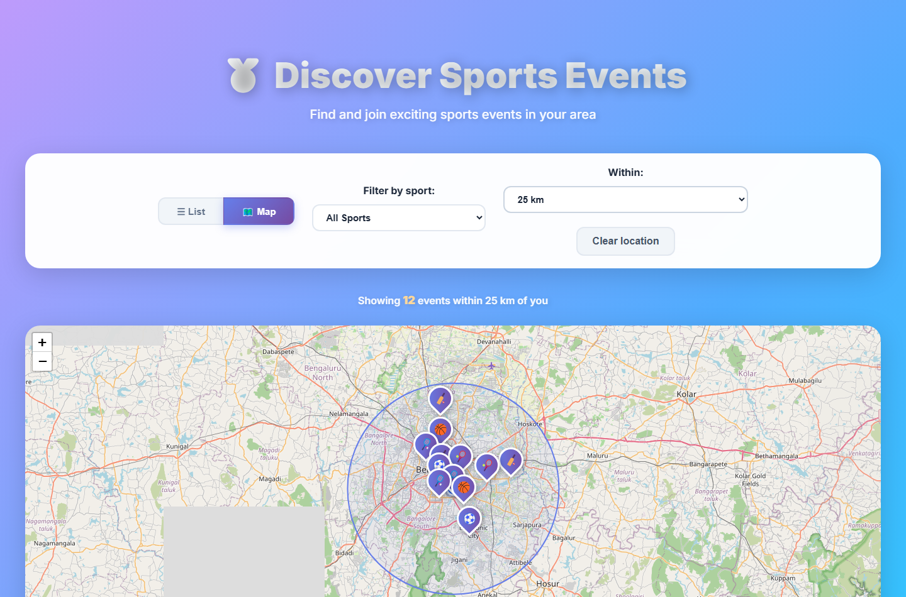
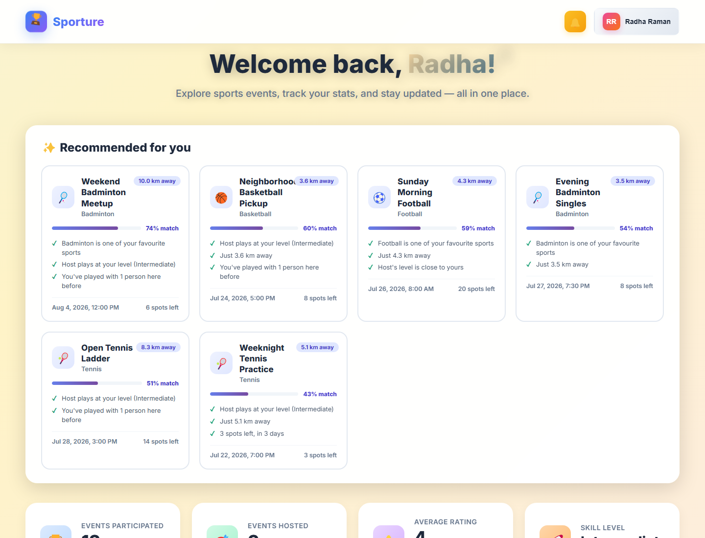
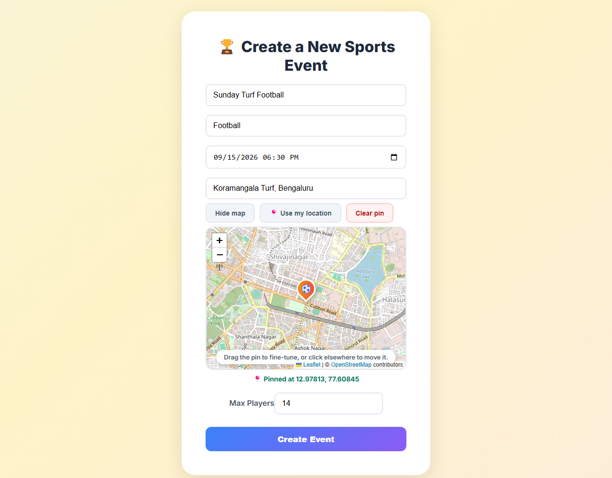
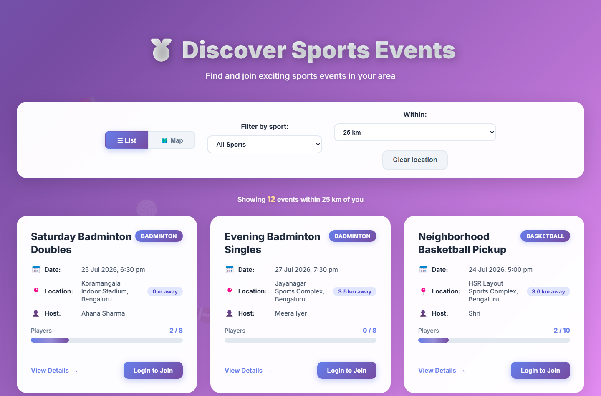
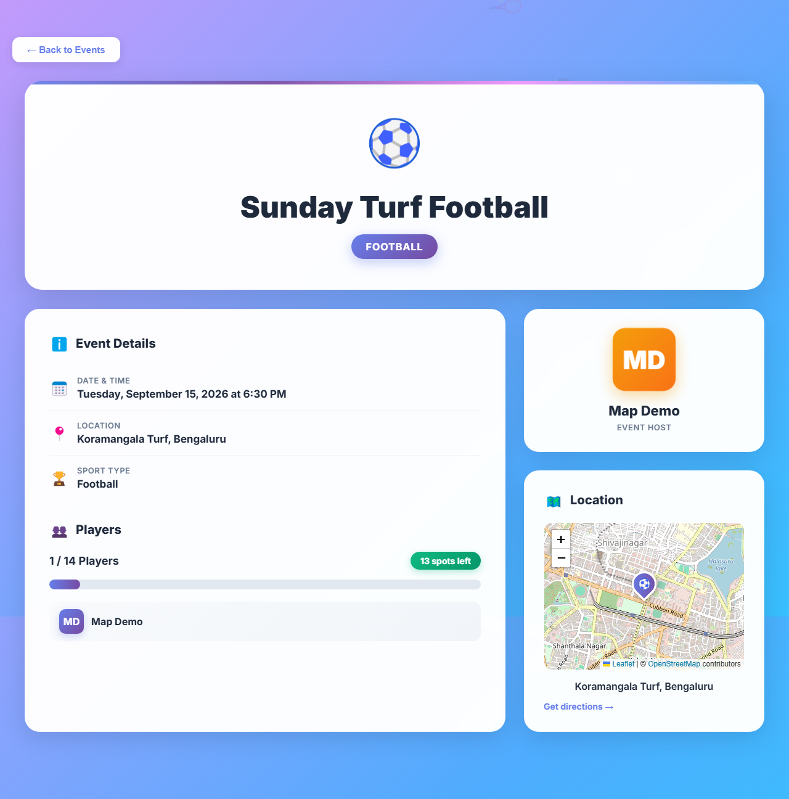

<div align="center">

# 🏆 Sporture

**Find and join local sports events near you.**

A full-stack TypeScript application built around geospatial search — events are
ranked by real distance from a MongoDB `2dsphere` index, then personalised per
user by a weighted scoring model.

</div>



<table>
  <tr>
    <td width="50%">
      
      <sub><b>Recommendations</b> — scored, and each one explains itself</sub>
    </td>
    <td width="50%">
      
      <sub><b>Venue picker</b> — drop or drag a pin for exact coordinates</sub>
    </td>
  </tr>
  <tr>
    <td width="50%">
      
      <sub><b>List view</b> — the same query, sorted nearest-first</sub>
    </td>
    <td width="50%">
      
      <sub><b>Event detail</b> — participants, capacity and directions</sub>
    </td>
  </tr>
</table>

---

## Quick start

Docker is the shortest path — no MongoDB install, no Atlas account:

```bash
git clone https://github.com/guru-bharadwaj20/Sporture.git
cd Sporture

docker compose up --build
docker compose --profile seed run --rm seed
```

Open **http://localhost:8080** and sign in as `radha@example.com` /
`Password123!`. Search near Koramangala (12.9352, 77.6245) to see the radius
filter working against the seeded venues.

`docker compose down -v` stops everything and drops the database volume.

---

## Features

**Proximity search** — find events within an adjustable radius using browser
geolocation, sorted nearest-first with the distance shown on every card.
Addresses are geocoded server-side via OpenStreetMap Nominatim, with an
in-process cache and request throttling to respect the provider's usage policy.

**Personalised recommendations** — events ranked per user across five weighted
signals: sport affinity, proximity, skill match, shared history with other
players, and urgency. Every suggestion lists the reasons behind its score.

**Interactive maps** — a list/map toggle on discovery, sport-aware markers, a
radius circle around your position, and a click-or-drag venue picker when
creating an event. Leaflet with OpenStreetMap tiles, so no API key is needed.

**Events** — create, browse and join. Capacity is enforced atomically, so
simultaneous joins can never overbook. Past events are rejected at creation and
can't be joined.

**Accounts** — JWT auth with bcrypt-hashed passwords, editable profiles with
avatar upload, and community feedback attributed to the authenticated user.

---

## Stack

| Layer | Technology |
|---|---|
| Language | TypeScript (strict, both sides) |
| Frontend | React 19, React Router 7, Vite 7, Leaflet |
| Backend | Node.js, Express 5 |
| Database | MongoDB with Mongoose 8 and a `2dsphere` index |
| Auth | JWT, bcrypt |
| Validation | Zod |
| Security | Helmet, CORS allowlist, rate limiting |
| Testing | Vitest, Supertest, React Testing Library, mongodb-memory-server |
| Infra | Docker Compose, nginx, GitHub Actions |

---

## Architecture

```
Sporture/
├── shared/api.ts        Wire-format API contract, imported by both sides
├── Client/              React SPA
│   └── src/
│       ├── components/
│       │   ├── pages/   Route-level components
│       │   ├── common/  Map, venue picker, recommendations, toasts, error boundary
│       │   └── utils/   API client, session storage, error narrowing, geolocation
│       └── test/        Shared render harness and fixture builders
└── Server/              Express API
    ├── app.ts           Builds the app — no side effects, importable by tests
    ├── server.ts        Process entry: connect, listen
    ├── config/          Env validation and DB connection
    ├── middleware/      Auth, Zod validation, rate limiting, error handling
    ├── models/          Mongoose schemas and their interfaces
    ├── routes/          Route handlers
    ├── services/        Geocoding, recommendation scoring
    └── validators/      Zod schemas — the single source of truth for input
```

### Design decisions

**One API contract, two consumers.** `shared/api.ts` describes the JSON *on the
wire*, which is deliberately not the Mongoose models: dates arrive as ISO
strings and populated references as nested objects. A client typed against the
model would believe `event.date` is a `Date` and break on `.getTime()`. Request
*input* types come from `z.infer` on the Zod schemas, so the validated shape and
its static type cannot drift apart.

**Zod schemas double as field allowlists.** Because Zod strips unknown keys, a
client that posts `{ name, rating: 5, role: "admin" }` gets only `name` through.
Mass assignment is prevented by the same declaration that validates types.

**Joining an event is one atomic operation.** The capacity and duplicate checks
live inside the filter of a single `findOneAndUpdate`:

```js
{ _id: id,
  createdBy:      { $ne: userId },
  currentPlayers: { $ne: userId },
  $expr: { $lt: [{ $size: "$currentPlayers" }, "$maxPlayers"] } }
```

A read-then-write would let two concurrent requests both observe a free slot and
both write. A test fires six simultaneous joins at a two-slot event and asserts
exactly two succeed.

**Recommendation scoring is a pure module.** `services/recommendations.ts`
touches no database and reads no clock — `now` is injected. Each signal returns
a value in `[0, 1]` and the score is a weighted mean:

```
score = (3.0·sportAffinity + 2.5·proximity + 2.0·skillMatch
       + 1.5·socialSignal + 1.0·urgency) / 10.0
```

Purity is what makes the weighting testable, and ranking rules are exactly the
part most likely to be retuned. Proximity decays exponentially with a 5 km
half-life rather than linearly, because the difference between 1 km and 3 km
matters far more to a player than 20 km versus 22 km. Skill is ordinal, so
Beginner→Intermediate is a much smaller penalty than Beginner→Professional.

**Locations are GeoJSON.** `location` stores `{ address, geo: { type: "Point",
coordinates: [lng, lat] } }`. MongoDB requires longitude first — the reverse of
how coordinates are spoken and of what the browser's geolocation API returns —
so the swap happens once, at the validation boundary.

---

## API

| Method | Endpoint | Auth | Description |
|---|---|---|---|
| `POST` | `/api/auth/register` | — | Create an account |
| `POST` | `/api/auth/login` | — | Obtain a JWT |
| `GET` | `/api/auth/me` | ✅ | Current user |
| `GET` | `/api/events` | — | List or search events |
| `POST` | `/api/events` | ✅ | Create an event |
| `GET` | `/api/events/:id` | — | Event detail |
| `GET` | `/api/events/joined` | ✅ | Events you host or joined |
| `GET` | `/api/events/recommended` | ✅ | Personalised ranking |
| `POST` | `/api/events/:id/join` | ✅ | Join an event |
| `GET` | `/api/users/:id` | ✅ | Public profile |
| `PUT` | `/api/users/:id` | ✅ | Update own profile |
| `POST` | `/api/users/:id/upload-photo` | ✅ | Upload avatar |
| `GET` | `/api/feedback` | — | List feedback |
| `POST` | `/api/feedback` | ✅ | Submit feedback |
| `DELETE` | `/api/feedback/:id` | ✅ | Delete own feedback |
| `GET` | `/health` | — | Liveness check |

### Proximity search

```
GET /api/events?lat=12.9352&lng=77.6245&radius=5000&sport=badminton
```

| Param | Description |
|---|---|
| `lat`, `lng` | Centre point. Must be given together. |
| `radius` | Metres, max 200 000. Defaults to 25 000. |
| `sport` | Exact match, case-insensitive; metacharacters escaped. |
| `upcoming` | `false` to include events that already started. Defaults to `true`. |

With coordinates, each event gains a `distanceMetres` field and results are
ordered nearest-first. Without them the response is a chronological listing.

### Recommendations

```
GET /api/events/recommended?lat=12.9352&lng=77.6245&limit=6
```

```json
{
  "score": 0.742,
  "title": "Weekend Badminton Meetup",
  "breakdown": { "sport": 1, "proximity": 0.25, "skill": 1, "social": 0.5, "urgency": 0.61 },
  "reasons": [
    "Badminton is one of your favourite sports",
    "Host plays at your level (Intermediate)",
    "You've played with 1 person here before"
  ]
}
```

---

## Local development

Node.js 20+ and MongoDB (local or Atlas).

```bash
cd Server
npm install
cp .env.example .env
npm run seed
npm run dev
```

```bash
cd Client
npm install
cp .env.example .env.local
npm run dev
```

### Environment

| Variable | Required | Notes |
|---|---|---|
| `MONGO_URI` | ✅ | **Include a database name** — without one MongoDB silently uses `test`. |
| `JWT_SECRET` | ✅ | Minimum 32 characters. Generate with `node -e "console.log(require('crypto').randomBytes(48).toString('hex'))"` |
| `PORT` | | Defaults to 5000 |
| `JWT_EXPIRES_IN` | | Defaults to `1d` |
| `CLIENT_ORIGINS` | | Comma-separated CORS allowlist |
| `BACKEND_URL` | | Public API origin, used to build upload URLs |
| `NODE_ENV` | | **Set to `production` when deploying** — otherwise stack traces are returned in errors |

The server refuses to start if `MONGO_URI` or `JWT_SECRET` is missing, or if the
secret is too short, so misconfiguration surfaces at boot rather than on the
first request.

### Seed data

`npm run seed` creates ten users sharing the password `Password123!` (override
with `SEED_PASSWORD`) and twelve events across real Bengaluru venues 3–20 km
apart — enough spread to demonstrate radius search. Event dates are relative to
run time, so re-run it if the demo data looks stale.

---

## Testing

```bash
cd Server && npm test     # 156 tests
cd Client && npm test     # 179 tests
```

Server tests run against an in-memory MongoDB; client tests run in jsdom with
the API module mocked. Neither needs a running server or a real database, so
both run unchanged in CI.

Coverage is weighted toward properties that fail quietly rather than loudly:

- passwords are stored hashed and never returned
- login does not reveal whether an account exists
- users cannot edit other users' profiles
- privileged fields (`rating`, `role`, `email`) cannot be set by a client
- concurrent joins cannot overbook an event
- regex metacharacters in query params are matched literally
- session storage returns `null` for malformed data instead of throwing
- the error boundary renders a fallback rather than a blank page
- the API client never sends a half-populated coordinate pair

CI runs typecheck, lint, tests and build for both packages on every push.

---

## License

[MIT](LICENSE)
